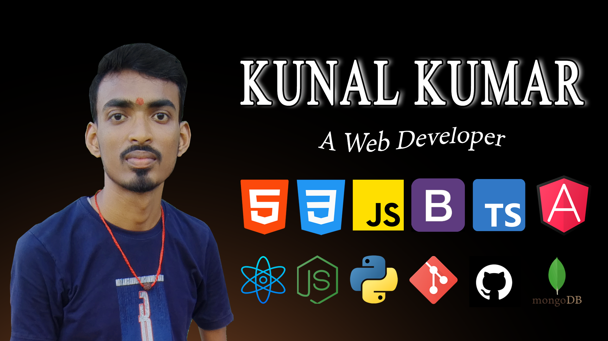

# 👋 Hi, I'm Kunal Kumar

💻 **Frontend Developer | MEAN Stack Developer | Angular Developer**

I am passionate about building modern, responsive, and user-friendly web applications using **Angular, React, ExpressJs, NodeJS, MongoDB**.

---

## 🎓 Education

| Degree | Institution               | Year      |
| ------ | ------------------------- | --------- |
| MCA    | Sikkim Manipal University | 2025–2027 |

---

## 🛠️ Technical Skills

  

    <h3>Frontend</h3>
    
    
    
    
    
    
    
  

  
  

    <h3>Backend</h3>
    
    
    
  

---

### **DevOps & Tools**

- Git, GitHub

### **Other Tools**

- Microsoft Office (Word, Excel, PowerPoint – 2007, 2013, 2019, 365)

---

## 💼 Work Experience

### **Kosi Digital Services Pvt Ltd (May 2024 – July 2025)**

**Role:** Frontend Developer  
**Skillset:** Angular, React Js, Bootstrap, TypeScript, HTML, CSS  
**Responsibilities:**

- Creating responsive web pages

---

## 📫 How to Reach Me

- **Email:** [kunalkumar8963@gmail.com](mailto:kunalkumar8963@gmail.com)
- **LinkedIn:** [linkedin.com/in/kunalkumar8963](https://www.linkedin.com/in/kunalkumar8963/)
- **Portfolio:** [kunalkumar45.github.io/myportfolio](https://kunalkumar45.github.io/myportfolio)

---

⭐ _Feel free to explore my repositories and get in touch!_
